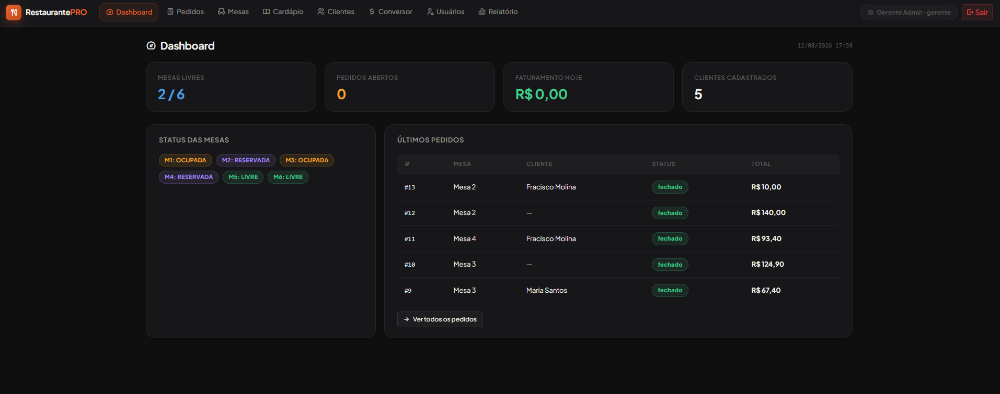
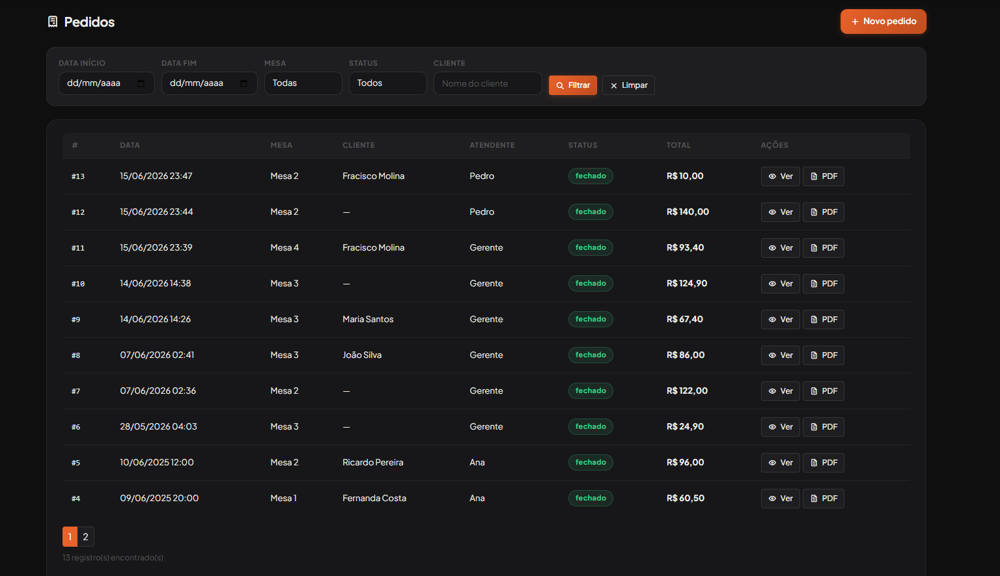
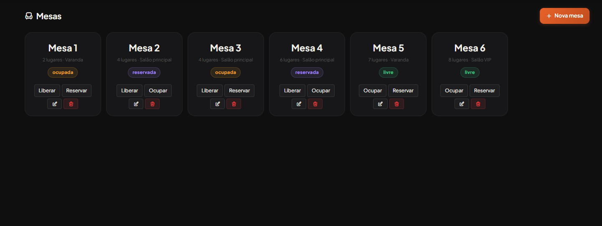
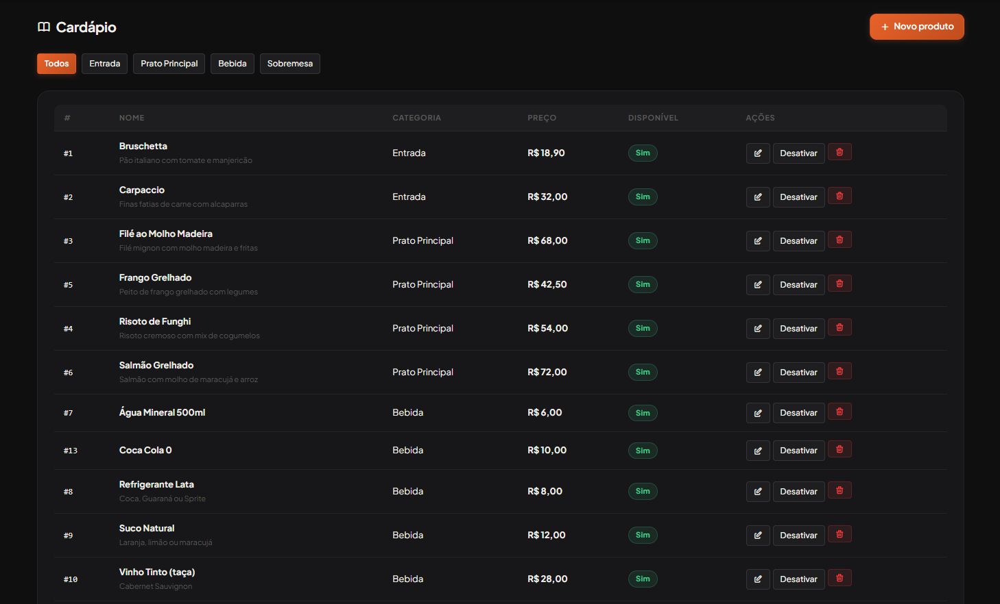
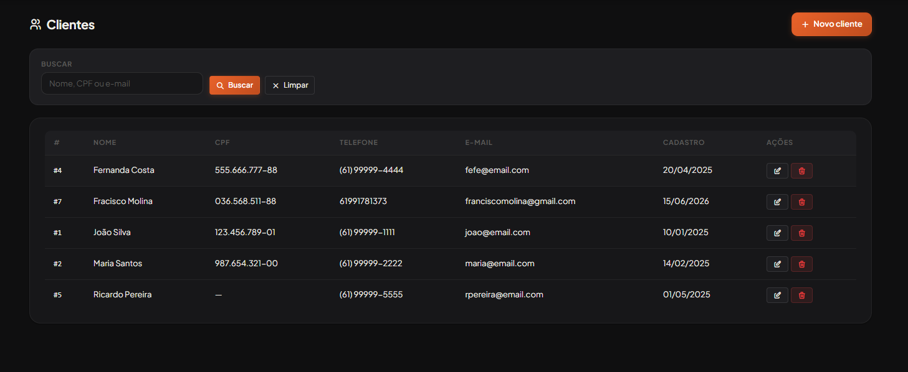
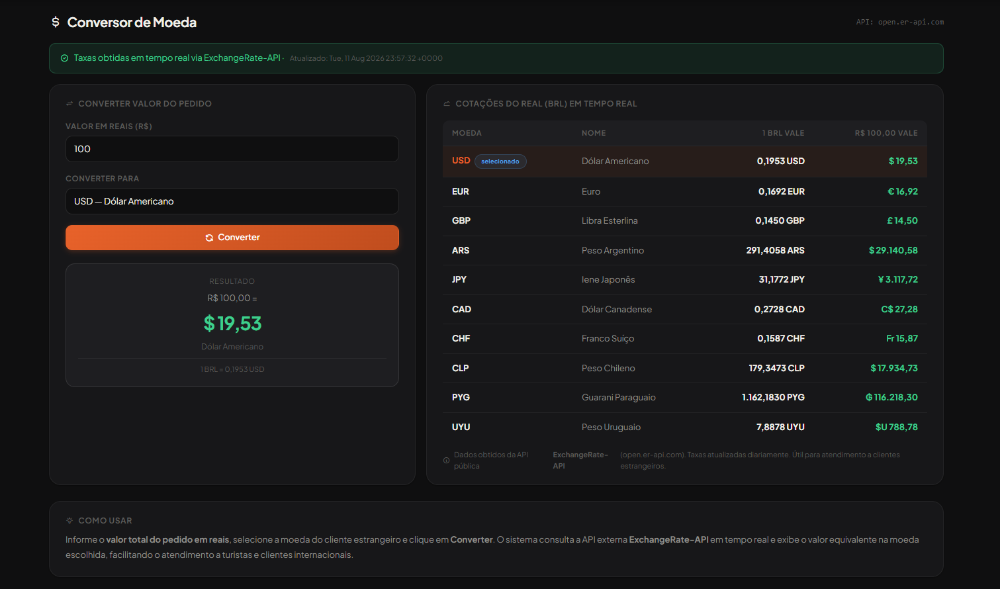
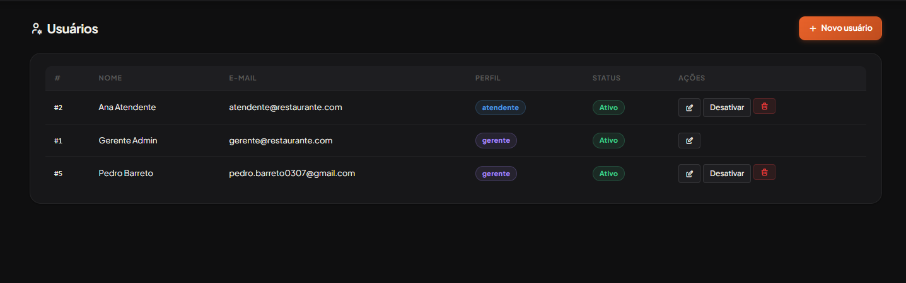
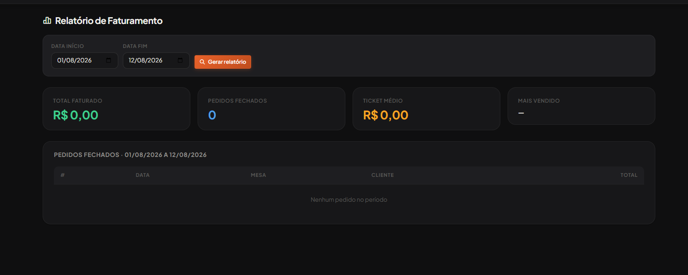

# RestaurantePRO

Sistema completo de gestão para restaurantes, desenvolvido em **PHP (PDO) + MySQL**, com autenticação por sessão, uma **API REST própria autenticada via Bearer Token**, controle de mesas em tempo real, pedidos, cardápio, clientes, relatórios em PDF e um conversor de moeda integrado a uma API externa.

Projeto acadêmico desenvolvido para a disciplina de **Desenvolvimento de Sistemas** — CEUB, construído do zero (sem frameworks), para consolidar fundamentos de back-end, banco de dados relacional, autenticação, API REST e integração com serviços externos.

---

## Funcionalidades

- **Dashboard** — visão geral com mesas livres/ocupadas, pedidos abertos, faturamento do dia e últimos pedidos
- **Pedidos** — CRUD completo com filtros por data, mesa, status e cliente; criação com múltiplos itens, fechamento e cancelamento
- **Mesas** — controle de status em tempo real (livre, ocupada, reservada), com capacidade e localização
- **Cardápio** — CRUD de produtos por categoria (entrada, prato principal, bebida, sobremesa), com ativação/desativação de itens
- **Clientes** — cadastro com validação de CPF único e busca por nome, CPF ou e-mail
- **Usuários e Perfis** — controle de acesso por perfil (**gerente** / **atendente**), com páginas restritas por sessão
- **Relatório de Faturamento** — total faturado, pedidos fechados, ticket médio e produtos mais vendidos, filtrável por período
- **Conversor de Moeda** — consulta cotações do Real em tempo real via [ExchangeRate-API](https://open.er-api.com), com fallback local caso a API externa esteja fora do ar
- **API REST própria** — endpoints de autenticação, mesas, pedidos, produtos e relatório, protegidos por Bearer Token, com controle de acesso por perfil

---

## Tecnologias

| Camada | Tecnologia |
|---|---|
| Back-end | PHP (PDO, orientado a funções) |
| Banco de dados | MySQL |
| Front-end | Bootstrap 5, Tabler Icons, JavaScript vanilla |
| Fontes | Google Fonts (Plus Jakarta Sans) |
| Ambiente local | XAMPP (Apache + PHP + MySQL) |
| Autenticação (páginas) | Sessão PHP (`$_SESSION`) |
| Autenticação (API) | Bearer Token, armazenado no banco (`token_api`) |
| API externa | ExchangeRate-API |

---

## Estrutura do projeto

```
RestaurantePRO/
├── api/                        # API REST — autenticação via Bearer Token
│   ├── .htaccess                # Repassa o header Authorization no Apache/XAMPP
│   ├── auth.php                 # POST → login e geração de token
│   ├── core.php                 # Helpers: resposta(), erro(), autenticarToken()
│   ├── mesas.php                # GET → lista mesas (com filtro por status)
│   ├── pedidos.php               # GET/POST/PUT → consulta, cria, fecha e cancela pedidos
│   ├── produtos.php              # GET → lista produtos do cardápio
│   └── relatorio.php             # GET → relatório de faturamento (somente gerente)
│
├── assets/
│   ├── css/
│   │   └── estilo.css           # Design system completo (variáveis, cards, badges, etc.)
│   └── js/
│       └── app.js               # Toasts de sucesso/erro e confirmação de exclusão
│
├── includes/                    # Compartilhado entre as páginas autenticadas por sessão
│   ├── auth.php                  # Sessão: login, logout, exigirLogin(), exigirGerente()
│   ├── config.example.php        # MODELO de configuração do banco (versionado)
│   ├── config.php                # Configuração real do banco (NÃO versionar!)
│   ├── footer.php                # Fecha o layout e carrega os scripts
│   ├── header.php                # Navbar + menu (itens condicionais por perfil)
│   └── logout.php                # Encerra a sessão
│
├── pages/                       # Páginas do sistema (protegidas por sessão)
│   ├── cardapio.php
│   ├── clientes.php
│   ├── conversor.php
│   ├── dashboard.php
│   ├── mesas.php
│   ├── pedidos.php
│   ├── relatorio.php              # restrito a perfil "gerente"
│   ├── usuarios.php                # restrito a perfil "gerente"
│   └── ver_pedido.php
│
├── relatorios/                  # Geração de PDFs
│   ├── comprovante.php            # Comprovante de um pedido específico
│   └── faturamento_pdf.php        # Relatório de faturamento em PDF
│
├── banco.sql                    # Script de criação das tabelas
├── banco.zip                    # Backup/dump completo do banco (não versionado)
├── gerar_senha.php               # Utilitário para gerar hash bcrypt de senha
└── index.php                     # Página de login / ponto de entrada
```

---

## Como o sistema é organizado (arquitetura)

O projeto tem **duas frentes de autenticação separadas**, e é importante entender isso antes de mexer no código:

1. **`pages/`** — as telas que você usa no navegador (dashboard, pedidos, mesas etc.) são protegidas por **sessão PHP**. Toda página começa chamando `exigirLogin()` (de `includes/auth.php`), que redireciona para `index.php` se ninguém estiver logado. Páginas de gerente (Usuários, Relatório) usam `exigirGerente()`.

2. **`api/`** — os endpoints da API são protegidos por **Bearer Token**, não por sessão. O fluxo é:
   - `POST /api/auth.php` com e-mail e senha → retorna um `token`
   - Esse token é salvo na coluna `token_api` da tabela `usuarios`
   - Toda outra rota da API (`mesas.php`, `pedidos.php`, `produtos.php`, `relatorio.php`) exige o header `Authorization: Bearer SEU_TOKEN`, validado por `autenticarToken()` em `api/core.php`

Essas duas autenticações são **independentes** — logar no site não gera automaticamente um token de API, e vice-versa.

---

## Preview

### Dashboard
Visão geral com status das mesas, pedidos abertos, faturamento do dia e últimos pedidos.



### Pedidos
Listagem com filtros por data, mesa, status e cliente, com ações de visualizar e exportar em PDF.



### Mesas
Controle visual do status de cada mesa (livre, ocupada, reservada), com capacidade e localização.



### Cardápio
Gestão de produtos por categoria, com preço e disponibilidade.



### Clientes
Cadastro com busca por nome, CPF ou e-mail.



### Conversor de Moeda
Cotação do Real em tempo real via ExchangeRate-API, para atendimento a clientes estrangeiros.



### Usuários
Controle de acesso por perfil (gerente / atendente).



### Relatório de Faturamento
Total faturado, pedidos fechados, ticket médio e item mais vendido, filtrável por período.



---

## Passo a passo para rodar o projeto localmente

### 1. Pré-requisitos
- [XAMPP](https://www.apachefriends.org/) instalado (Apache + PHP + MySQL)
- PHP 7.4 ou superior, com extensão **PDO MySQL** habilitada (vem ativada por padrão no XAMPP)
- Git instalado

### 2. Clonar o repositório

Clone o projeto **dentro da pasta `htdocs`** do XAMPP:

```bash
cd C:/xampp/htdocs
git clone https://github.com/SEU_USUARIO/restaurante-pro.git
cd restaurante-pro
```

### 3. Iniciar os serviços

Abra o **XAMPP Control Panel** e inicie:
- **Apache**
- **MySQL**

### 4. Criar e importar o banco de dados

1. Acesse `http://localhost/phpmyadmin`
2. Crie um banco de dados chamado `restaurantepro` (mesmo nome usado em `DB_NAME`, no passo 5)
3. Selecione o banco criado, vá em **Importar** e envie o arquivo `banco.sql` (na raiz do projeto)

> ⚠️ **Importante:** o arquivo `api/auth.php` grava o token de acesso na coluna `token_api` da tabela `usuarios`. Confira se essa coluna já existe no `banco.sql` importado; se não existir, crie manualmente:
> ```sql
> ALTER TABLE usuarios ADD COLUMN token_api VARCHAR(64) NULL;
> ```
> Sem essa coluna, o login pela **API** (`/api/auth.php`) vai falhar — o login pelas **páginas do site** não depende dela.

### 5. Configurar a conexão com o banco

O arquivo `includes/config.php` **contém credenciais e não deve ser versionado no Git**. Por isso o repositório traz um modelo:

```
includes/config.example.php
```

Copie esse arquivo, renomeie a cópia para `config.php` (mesma pasta) e ajuste as constantes:

```php
define('DB_HOST', '127.0.0.1');
define('DB_NAME', 'restaurantepro');
define('DB_USER', 'root');
define('DB_PASS', '');   // sua senha do MySQL local
```

Os valores padrão já funcionam com uma instalação limpa do XAMPP (usuário `root`, senha vazia).

### 6. Gerar uma senha de usuário (se precisar)

Use o utilitário `gerar_senha.php` para gerar o hash bcrypt de uma senha e inserir manualmente um novo usuário na tabela `usuarios` via phpMyAdmin:

```
http://localhost/restaurante-pro/gerar_senha.php
```

### 7. Acessar o sistema

```
http://localhost/restaurante-pro/index.php
```

Faça login com um usuário existente no `banco.sql` (confira a tabela `usuarios` no phpMyAdmin) ou crie um novo pelo passo anterior.

---

## 📄 API REST

Todos os endpoints (exceto `auth.php`) exigem o header:
```
Authorization: Bearer SEU_TOKEN
```

### Autenticação

```bash
curl -X POST http://localhost/restaurante-pro/api/auth.php \
  -H "Content-Type: application/json" \
  -d '{"email":"gerente@restaurante.com","senha":"123456"}'
```
Retorna `token` e os dados básicos do usuário.

### Endpoints disponíveis

| Método | Endpoint | Descrição | Acesso |
|---|---|---|---|
| POST | `/api/auth.php` | Login e geração de token | Público |
| GET | `/api/mesas.php` | Lista mesas (filtro `?status=`) | Qualquer usuário autenticado |
| GET | `/api/produtos.php` | Lista produtos do cardápio (filtro `?categoria=`) | Qualquer usuário autenticado |
| GET | `/api/pedidos.php` | Lista pedidos (filtros de data, mesa, status) | Qualquer usuário autenticado |
| GET | `/api/pedidos.php?id=X` | Detalha um pedido com seus itens | Qualquer usuário autenticado |
| POST | `/api/pedidos.php` | Cria um novo pedido | Qualquer usuário autenticado |
| PUT | `/api/pedidos.php?id=X&acao=fechar` | Fecha um pedido | Qualquer usuário autenticado |
| PUT | `/api/pedidos.php?id=X&acao=cancelar` | Cancela um pedido | Qualquer usuário autenticado |
| GET | `/api/relatorio.php` | Relatório de faturamento (filtros `f_ini`, `f_fim`) | Somente **gerente** |

Exemplo — criar pedido:
```bash
curl -X POST http://localhost/restaurante-pro/api/pedidos.php \
  -H "Authorization: Bearer SEU_TOKEN" \
  -H "Content-Type: application/json" \
  -d '{
    "id_mesa": 2,
    "id_cliente": 1,
    "observacao": "Sem cebola",
    "itens": [
      { "id_produto": 3, "quantidade": 2 },
      { "id_produto": 7, "quantidade": 1 }
    ]
  }'
```

### Sobre o `.htaccess` em `api/`

O Apache do XAMPP, por padrão, **não repassa o header `Authorization`** para o PHP. O arquivo `api/.htaccess` corrige isso:
```apache
RewriteEngine On
RewriteCond %{HTTP:Authorization} ^(.*)
RewriteRule .* - [e=HTTP_AUTHORIZATION:%1]
```
Sem esse arquivo, todas as chamadas autenticadas da API retornam erro 401, mesmo com um token válido — a função `getAuthHeader()` em `api/core.php` já tenta 3 formas diferentes de capturar o header por causa dessa inconsistência do Apache.

---

## Perfis de acesso

| Perfil | Acesso |
|---|---|
| **Gerente** | Acesso total: dashboard, pedidos, mesas, cardápio, clientes, conversor, **usuários** e **relatório** |
| **Atendente** | Acesso a: dashboard, pedidos, mesas, cardápio, clientes, conversor (sem usuários/relatório) |

O controle é feito tanto na navbar (`includes/header.php`, oculta os links) quanto no back-end das páginas restritas, via `exigirGerente()`.

---

## Aprendizados do projeto

- Modelagem de banco relacional com múltiplas entidades (pedidos, itens de pedido, mesas, clientes, usuários, produtos)
- Dois sistemas de autenticação coexistindo: sessão PHP para o site e Bearer Token para a API
- Uso de PDO com *prepared statements* em todas as queries (proteção contra SQL Injection)
- Transações (`beginTransaction`/`commit`/`rollBack`) na criação de pedidos com múltiplos itens
- Geração dinâmica de relatórios e comprovantes em PDF
- Consumo de API externa em tempo real (cotação de moedas), com estratégia de *fallback* em caso de falha
- Construção de uma API REST própria, com controle de acesso por perfil
- Resolução de problemas reais de ambiente (headers HTTP somem no Apache, hash de senha com bcrypt, `session_regenerate_id` contra session fixation)

---

## Autor

**Pedro Barreto**
Projeto desenvolvido para a disciplina de Desenvolvimento de Sistemas — CEUB

---

## Licença

Este projeto é de uso acadêmico e está disponível para fins de estudo e portfólio.
